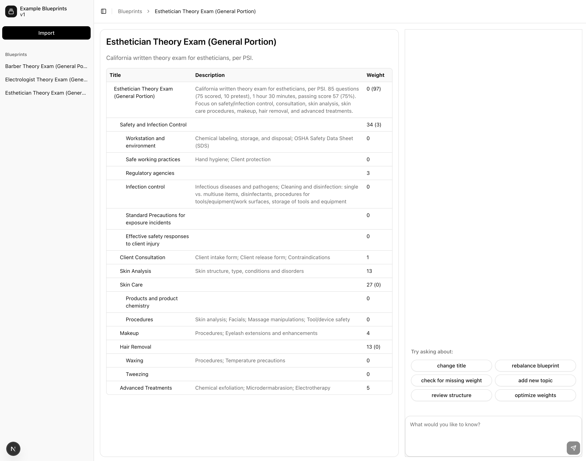
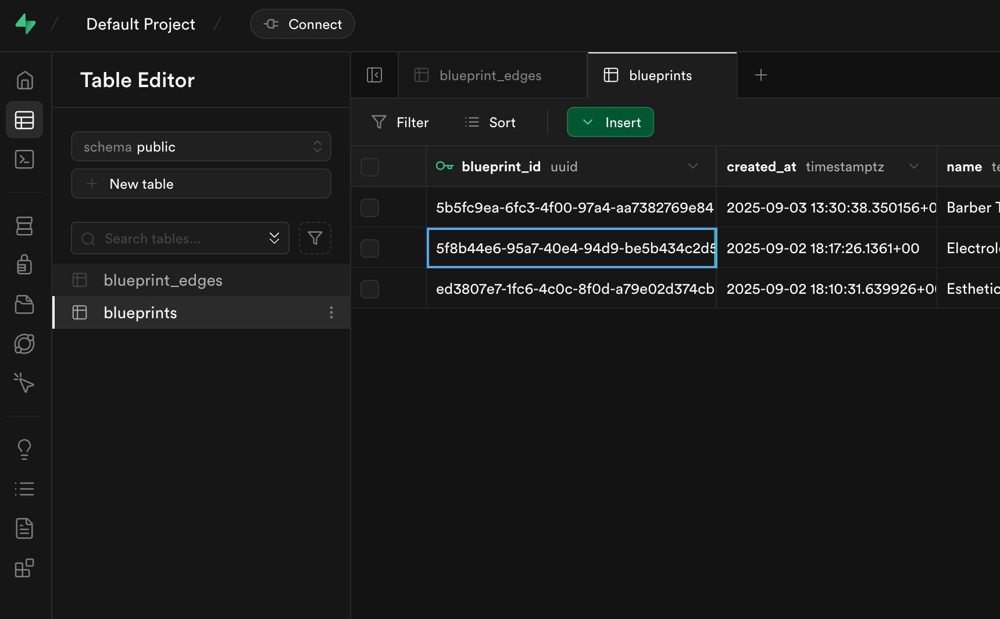
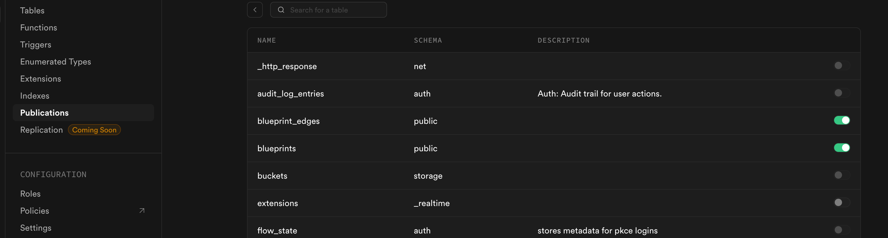

# PDF to Exam Blueprints

An AI-powered tool that converts PDF/Word documents containing semi-structured exam blueprints into interactive, graph-based blueprints that can be edited through natural language chat.

## What it does

This application uses AI to analyze educational documents and extract exam topics, subtopics, and their weight distributions. The extracted data is stored as a hierarchical graph structure where:

-   **Topics** are the main subjects (e.g., "Mathematics", "Physics")
-   **Subtopics** are specific areas within topics (e.g., "Algebra", "Calculus" under Mathematics)
-   **Weights** represent the percentage distribution of exam questions (always summing to 100%)

The graph-based approach allows for intuitive editing through chat interactions, making it easy to modify, reorganize, and optimize exam blueprints.

## Database Schema

The application uses two main tables to store the blueprint data:

1. **`blueprints`** - Stores the main blueprint metadata:

    - `blueprint_id` (UUID, primary key)
    - `name` (text) - The name of the blueprint
    - `description` (text) - Description of the blueprint
    - `file_id` (text) - Reference to the original uploaded file
    - `ai_notes` (text) - AI-generated analysis notes
    - `created_at` (timestamp)

2. **`blueprint_edges`** - Stores the hierarchical structure of topics and subtopics:
    - `edget_id` (UUID, primary key)
    - `blueprint_id` (UUID, foreign key to blueprints)
    - `parent_id` (UUID, nullable) - References another edge (null for root topics)
    - `title` (text) - The topic/subtopic name
    - `description` (text) - Description of the topic/subtopic
    - `weight` (smallint) - Percentage weight (0-100)
    - `position` (integer) - Ordering position
    - `created_at` (timestamp)

## Screenshots

### User Interface



### Database Setup



### Realtime Updates Configuration



## Setup

### Prerequisites

-   Node.js (v18 or higher)
-   Supabase CLI
-   OpenAI API key

### Environment Variables

Create a `.env` file in the root directory with the following variables:

```env
OPENAI_API_KEY=your_openai_api_key_here
NEXT_PUBLIC_SUPABASE_URL=your_supabase_project_url
NEXT_PUBLIC_SUPABASE_ANON_KEY=your_supabase_anon_key
```

### Database Setup

1. **Start Supabase locally:**

    ```bash
    npx supabase start
    ```

2. **Optional: For new Supabase projects, apply migrations:**

    ```bash
    npx supabase db up
    ```

3. **Configure Realtime Updates:**
    - Go to your Supabase dashboard
    - Navigate to **Database** → **Publications**
    - Enable realtime updates for the `blueprint_edges` and `blueprints` tables by toggling the switches to the "on" position

### Install Dependencies

```bash
npm install
```

### Start Development Server

```bash
npm run dev
```

The application will be available at `http://localhost:3000`

## Usage

1. **Create a new blueprint:** Upload a PDF or Word document containing exam structure
2. **Review AI analysis:** The system will extract topics, subtopics, and weights
3. **Edit via chat:** Use natural language to modify the blueprint structure
4. **Export:** Download the finalized blueprint for use in exam planning

## Technology Stack

-   **Frontend:** Next.js 15, React 19, TypeScript
-   **UI Components:** shadcn/ui, Vercel AI-SDK
-   **Database:** Supabase (PostgreSQL)
-   **AI:** OpenAI API
-   **Styling:** Tailwind CSS
